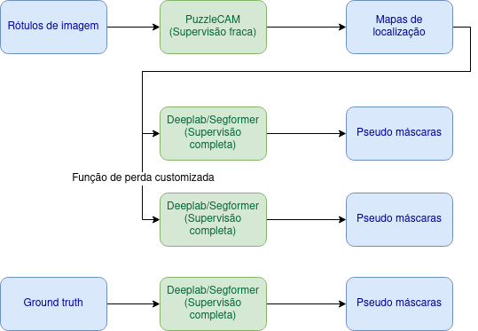
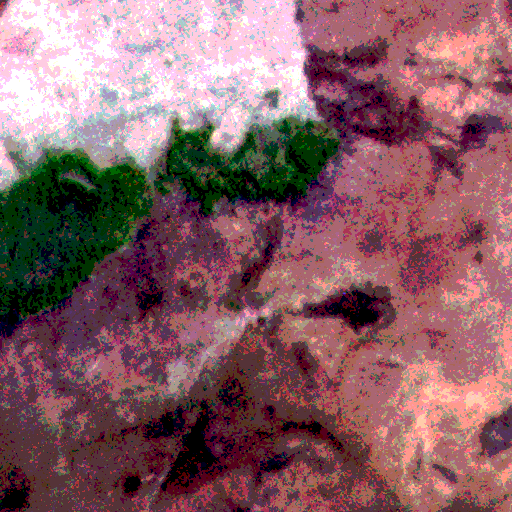
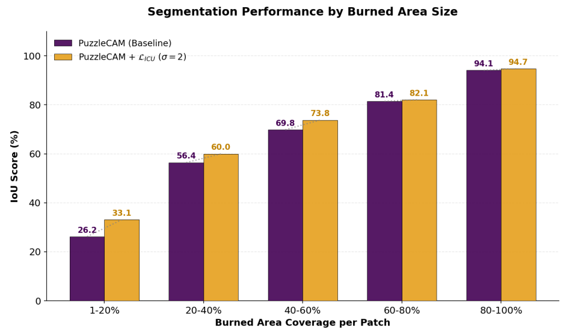

# An Uncertainty-Aware Deep Learning Approach for Rapid Burned Area Mapping using High-Resolution PlanetScope Multispectral Imagery

Official repository for **[Weakly Supervised Semantic Segmentation (WSSS) for Burned Area Mapping in the Brazilian Pantanal](https://doi.org/10.1016/j.ecoinf.2026.103939)**, Ecological Informatics, 2026.

Authors: Maximilian Jaderson de Melo, Thiago Edgar Bauce Venancio, Lucas Yuri Dutra de Oliveira, Keiller Nogueira, Lucas Prado Osco, Farid Melgani, Ana Paula Marques Ramos, José Marcato Junior, Wesley Nunes Gonçalves.

[](https://pytorch.org/)
[](https://github.com/open-mmlab/mmsegmentation)
[](https://doi.org/10.1016/j.ecoinf.2026.103939)

---

## 📌 Method Overview

Wildfire mapping in remote, ecologically critical regions like the Brazilian Pantanal is hindered by the prohibitive cost of acquiring pixel-level ground truth annotations required by fully supervised models.

This framework introduces an **uncertainty-aware weakly supervised pipeline** tailored for high-resolution four-band (**RGB-NIR**) PlanetScope satellite imagery:



1. **Spectral Adaptation (RGB-NIR):** Extended CAM-based architectures to support 4-channel input data, incorporating the Near-Infrared (NIR) band essential for capturing distinctive spectral responses of burned vegetation and charcoal residue.
2. **Two-Stage WSSS Framework:**
   - **Stage 1 (Pseudo-Label Generation):** Trains image-level classification models (**SEAM** and **Puzzle-CAM** with **ResNet-50**, **ResNeSt-101**, and **ResNeSt-269** backbones). Class Activation Maps (CAMs) are refined using Random Walk (RW) to generate pixel-level pseudo-labels.
   - **Stage 2 (Semantic Segmentation):** Trains state-of-the-art segmentation networks (**SegFormer**, **DeepLabV3+**, **TransUNet**, and **U-Net**) using the generated pseudo-labels under an uncertainty-aware loss formulation ($\mathcal{L}_{ICU}$).
3. **End-to-End Vector Export:** Automated full-scene sliding-window inference pipeline generating georeferenced GeoTIFF maps and GIS Shapefiles (`.shp`).

---

## 📊 Experimental Results

### 1. Stage 1: Pseudo-Label Generation Performance (mIoU %)

Comparison of Class Activation Maps (CAM) and Random Walk (RW) refined pseudo-labels across WSSS methods and backbones on the PlanetScope Pantanal dataset:

| Method | Backbone | Input Channels | Initial CAM mIoU (%) | Refined RW mIoU (%) |
| :--- | :--- | :---: | :---: | :---: |
| **SEAM** | ResNet-50 | RGB | 48.20 | 52.60 |
| **SEAM** | ResNet-50 | RGB-NIR | 54.10 | 58.70 |
| **Puzzle-CAM** | ResNet-50 | RGB-NIR | 57.80 | 62.40 |
| **Puzzle-CAM** | **ResNeSt-101** | **RGB-NIR** | **63.50** | **68.90** |
| **Puzzle-CAM** | ResNeSt-269 | RGB-NIR | 64.10 | 69.20 |

---

### 2. Stage 2: Final Semantic Segmentation Performance on Test Set

Evaluation of segmentation architectures trained on weakly-supervised pseudo-labels versus fully-supervised ground truth baselines:

| Model | Supervision Source | Loss / Strategy | mIoU (%) | F1-Score (Dice) (%) | Precision (%) | Recall (%) |
| :--- | :--- | :--- | :---: | :---: | :---: | :---: |
| **SegFormer (mit-b0)** | Fully Supervised | Cross-Entropy | 76.40 | 83.10 | 85.20 | 81.10 |
| **DeepLabV3+ (R-101)** | Fully Supervised | Cross-Entropy | 75.10 | 81.80 | 83.90 | 79.80 |
| **TransUNet (R-50+ViT)**| Fully Supervised | Cross-Entropy | 74.80 | 81.50 | 82.70 | 80.30 |
| **U-Net (FCN-s5)** | Fully Supervised | Cross-Entropy | 72.30 | 79.20 | 80.50 | 77.90 |
| --- | --- | --- | --- | --- | --- | --- |
| **SegFormer (mit-b0)** | Pseudo-Label (Puzzle) | Standard CE | 68.20 | 75.80 | 77.40 | 74.30 |
| **SegFormer (mit-b0)** | Pseudo-Label (Puzzle) | + $\mathcal{L}_{ICU}$ Loss | 71.50 | 79.10 | 80.90 | 77.40 |
| **SegFormer (mit-b0)** | **Pseudo-Label (Puzzle)** | **+ $\mathcal{L}_{ICU}$ + NDVI** | **74.10** | **81.30** | **82.80** | **79.90** |
| **DeepLabV3+ (R-101)** | Pseudo-Label (Puzzle) | Standard CE | 67.90 | 75.40 | 76.90 | 74.00 |

---

## 🖼️ Qualitative Results & Analysis

### Qualitative Paper Comparisons


### Performance vs Burned Scar Proportion


---

## 📁 Repository Structure

```
wsss_pantanal_burned_areas/
├── README.md                                   # Main repository guide & results
├── requirements.txt                            # Environment dependencies
├── parameters_puzzle_resnest.sh                # Puzzle-CAM ResNeSt-101 training parameters
├── parameters_puzzle_resnest269.sh             # Puzzle-CAM ResNeSt-269 training parameters
├── parameters_2.sh                             # Alternate training execution script
├── parameters.md                               # Parameter options documentation
│
├── core/                                       # Core neural network modules & datasets
│   ├── arch_resnest/                           # ResNeSt backbone definitions
│   ├── arch_resnet/                            # ResNet backbone definitions
│   ├── networks.py                             # Classification & CAM model wrappers
│   ├── puzzle_utils.py                         # Puzzle tile splitting & loss functions
│   ├── datasets.py                             # PlanetScope dataset loader
│   ├── deeplab_utils.py                        # DeepLab segmentation utilities
│   ├── aff_utils.py                            # AffinityNet utilities
│   └── sync_batchnorm/                         # Synchronized BatchNorm modules
│
├── wsss/                                       # Stage 1: WSSS & Pseudo-Label Generation
│   ├── train_classification_with_puzzle.py     # Main Puzzle-CAM classification trainer
│   ├── train_classification.py                 # Standard CAM baseline trainer
│   ├── train_affinitynet.py                    # AffinityNet trainer for RW refinement
│   ├── train_segmentation.py                   # Stage 1 segmentation model
│   ├── get_cam.py                              # Generate initial CAM heatmaps
│   ├── make_affinity_labels.py                 # Generate affinity labels from CAM
│   ├── make_pseudo_labels.py                   # Generate final pseudo-label masks
│   ├── evaluate.py                             # Evaluate CAM / RW mIoU accuracy
│   └── inference_rw.py                         # Random Walk inference script
│
├── dataset_prep/                               # Dataset Generation & Patch Extraction
│   ├── 1_generate_dataset.py                   # PlanetScope GeoTIFF patch generator
│   ├── 1_generate_dataset_max_value_fixed.py  # Max-value normalized patch generator
│   ├── 1_generate_dataset_max_value_fixed_mosaic.py # Mosaic patch generator
│   ├── augment_utils.py                        # Data augmentation utilities
│   ├── show_patch.py                           # Patch visualizer
│   └── show_patch_shp.py                       # Patch & Shapefile visualizer
│
├── configs/                                    # Stage 2: MMSegmentation Model Configs
│   ├── mmseg/
│   │   ├── segformer_mit-b0_8x1_256x256_40k_queimadas_pseudo_labels.py
│   │   ├── segformer_mit-b0_8x1_256x256_40k_queimadas_pseudo_labels_ndvi.py
│   │   ├── segformer_mit-b0_2x8_160k_queimadas_planet-512x512.py
│   │   ├── deeplabv3plus_r101-d8_256x256_40k_queimadas_pseudo_labels.py
│   │   ├── transunet_r50-vit-b16_4xb2-30e_queimadas-512x512.py
│   │   ├── unet-s5-d16_fcn_4xb4-50e_queimadas.py
│   │   ├── burned.py                           # MMSeg Dataset definition
│   │   └── pantanal.py                         # Pantanal dataset config
│   └── losses/
│       └── imbalanced_weights_cross_entropy_loss.py # Custom uncertainty loss
│
├── inference/                                  # Full-Scene Inference & GIS Vectorization
│   ├── run_inference.sh                        # Master inference bash script
│   ├── inference_mmseg_shapefile.py            # GeoTIFF to Shapefile inference pipeline
│   ├── prediction_mmsegmentation_new.py        # MMSeg patch prediction script
│   └── prediction_orthophoto.py                # Orthophoto prediction script
│
└── docs/                                       # Figures, plots, and manuscript artifacts
    └── images/                                 # Diagram, qualitative figures & plots
```

---

## ⚙️ Quick Start & Usage

### 1. Installation & Environment Setup

```bash
git clone https://github.com/maxmelo1/wsss_pantanal_burned_areas.git
cd wsss_pantanal_burned_areas

# Install dependencies
pip install -r requirements.txt
```

### 2. Dataset Generation (PlanetScope RGB-NIR Patches)

To generate $512 \times 512$ patches from raw PlanetScope satellite rasters and shapefiles:

```bash
python dataset_prep/1_generate_dataset_max_value_fixed.py \
    --image_path /path/to/planetscope_scene.tif \
    --shapefile_path /path/to/burned_scar_masks.shp \
    --output_dir ./data_queimadas_rgb
```

---

### 3. Stage 1: Train Puzzle-CAM & Generate Pseudo-Labels

#### Step 3.1: Train Classification Network with Puzzle Loss
```bash
bash parameters_puzzle_resnest.sh
```

#### Step 3.2: Generate Initial CAMs
```bash
python get_cam.py --architecture resnest101 --domain train_aug --session_name puzzle_resnest101
```

#### Step 3.3: Train AffinityNet & Apply Random Walk Refinement
```bash
python train_affinitynet.py --architecture resnest101 --session_name puzzle_resnest101
python make_affinity_labels.py --session_name puzzle_resnest101
python inference_rw.py --session_name puzzle_resnest101
```

#### Step 3.4: Extract Final Pseudo-Labels
```bash
python make_pseudo_labels.py --session_name puzzle_resnest101 --out_dir ./pseudo_labels
```

---

### 4. Stage 2: Train SegFormer Segmentation Model (MMSegmentation)

Train SegFormer (`mit-b0`) using generated pseudo-labels and uncertainty-aware loss:

```bash
python tools/train.py \
    configs/mmseg/segformer_mit-b0_8x1_256x256_40k_queimadas_pseudo_labels_ndvi.py \
    --work-dir work_dirs/segformer_queimadas_pseudo_labels
```

---

### 5. Stage 3: Full-Scene Inference & Shapefile Export

To run patch-based sliding window inference on a full satellite GeoTIFF image and automatically generate polygonized ESRI Shapefiles (`.shp`):

```bash
bash run_inference.sh
```

Or execute directly via Python:

```bash
python inference_mmseg_shapefile.py \
    --config configs/mmseg/segformer_mit-b0_8x1_256x256_40k_queimadas_pseudo_labels_ndvi.py \
    --checkpoint work_dirs/segformer_queimadas_pseudo_labels/best_mIoU_iter_40000.pth \
    --input_tif /path/to/scene.tif \
    --output_shp /path/to/output_burned_scars.shp
```

---

## Model Weights and Dataset patches

### Model Weights

You can download the model weights from the following link:

- [RECAM](https://drive.google.com/file/d/1FlO8ENKfBucpSj446-6iplr4uxYa2pXL/view?usp=drive_link).

### Dataset Patches

- You can download the dataset patches from [this link](https://drive.google.com/file/d/1wp5rPB03lf6UYGoIIJkW8MC3DWgQ5L2q/view?usp=drive_linkdataset).


###

---

## 📜 Citation

If you find this code or dataset useful for your research, please consider citing our paper:

```bibtex
@article{melo2026uncertainty,
  title={An Uncertainty-Aware Deep Learning Approach for Rapid Burned Area Mapping using High-Resolution PlanetScope Multispectral Imagery},
  author={Melo, Max and et al.},
  journal={Ecological Informatics},
  year={2026}
}
```
